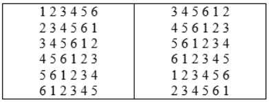

# **9.4-Latin-Squares**

## **Background**

A Latin Square is an n*n table filled with n different symbols in such a way that each symbol occurs exactly once in each row and exactly once in each column (see this [link](https://en.wikipedia.org/wiki/Latin_square)). For example, two possible Latin Squares of order 6:



The top-left numbers are 1 and 3 respectively.

## **Project Description** 

Your program will ask a user to input two numbers. The first number is the order of square; the second one is the top-left number of the square. Note that the second number should be between 1 and the first number, so your program should check this situation. Then, your program will print the corresponding Latin Square. Here is some example output:

**Example One:**

Input:
```
Please enter the order of squares: 
8
Please enter the top left number:
1
```

Output:
```
1 2 3 4 5 6 7 8
2 3 4 5 6 7 8 1
3 4 5 6 7 8 1 2
4 5 6 7 8 1 2 3
5 6 7 8 1 2 3 4
6 7 8 1 3 4 5 6
7 8 1 2 3 4 5 6
8 1 2 3 4 5 6 7
```
<br></br>
**Example Two:**

Input:
```
Please enter the order of squares: 
5
Please enter the top left number:
3
```

Output:
```
3 4 5 1 2
4 5 1 2 3
5 1 2 3 4
1 2 3 4 5
2 3 4 5 1
```


